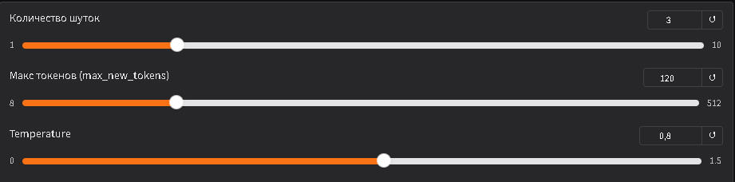
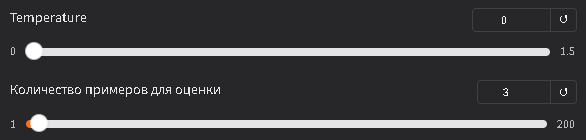
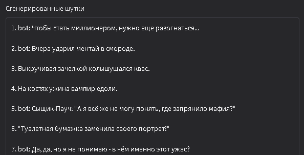
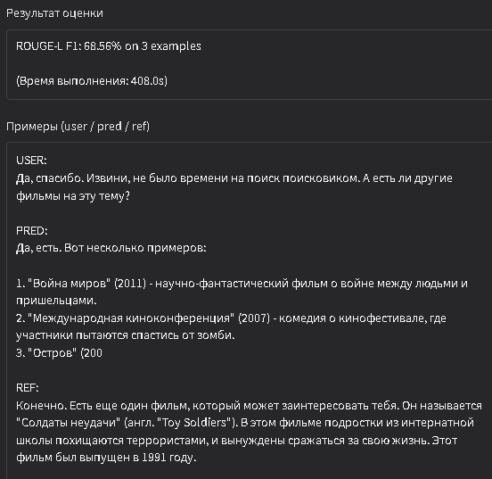

# Saiga CPU Evaluation

Приложение Saiga CPU Evaluation предоставляет интерфейс для исследования генеративных возможностей модели Saiga Mistral 7B на ресурсах CPU и оценки её качества с помощью датасета ru_turbo_saiga. 

**Приложение доступно по ссылке:**
## [HF](https://huggingface.co/spaces/DKartsev/Saiga-CPU-Evaluation)

## [COLAB](https://colab.research.google.com/drive/1dMv9XTBy3JyD1leRzfH_Ql67LNV_6zJ3?usp=sharing)

---

## Основные функции

### Генерация текста
- Создание коротких юмористических шуток на русском языке

- Настройка параметров генерации: количество шуток, максимальное число токенов, температура

### Оценка качества модели
- Автоматическая проверка генерации на датасете ru_turbo_saiga

- Метрика ROUGE-L F1 = 68.56% отражает степень совпадения предсказаний модели с эталонными ответами на выбранной выборке примеров

- Вывод примеров пользовательских запросов, предсказаний модели и эталонных ответов

### Визуализация результатов
- Отображение сгенерированных шуток, итоговой оценки и примеров в интерфейсе Gradio

- Возможность быстрой настройки параметров генерации и объема выборки для оценки